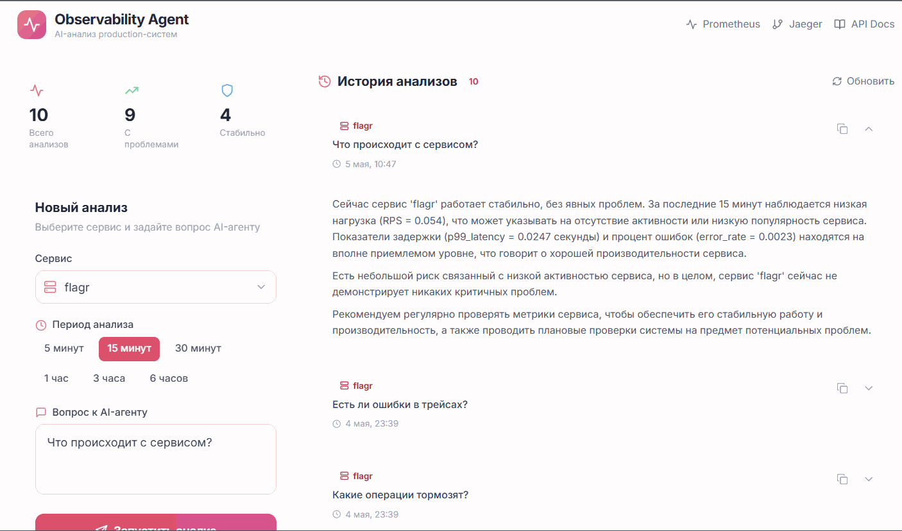

# Observability Intelligence Agent

> AI-агент для анализа production-систем: коррелирует метрики Prometheus, трейсы Jaeger и логи, объясняет на человеческом языке что происходит и почему.



## Как это работает

Вместо того чтобы вручную смотреть на графики Grafana и копаться в трейсах Jaeger, вы задаёте вопрос на человеческом языке — агент сам решает какие данные нужны, собирает их через инструменты и возвращает анализ.

Агент использует **Tool Use** — LLM самостоятельно решает вызвать `get_prometheus_metrics` или `get_jaeger_traces`, получает реальные данные и формирует ответ. Не RAG, не чат поверх документации — живые метрики production-системы.

## Stack

| Слой | Технологии |
|------|-----------|
| Backend | Python 3.12, FastAPI, asyncpg |
| AI | Groq API (Llama 3.3 70B), Tool Use |
| Observability | Prometheus, Jaeger / OpenTelemetry |
| Database | PostgreSQL 16 |
| Infra | Docker Compose, GitHub Actions CI |

## Architecture
```
User → POST /analyze → ObservabilityAgent
                           ↓ tool_calls
                    PrometheusTool → Prometheus HTTP API
                    JaegerTool     → Jaeger HTTP API
                           ↓ results
                    Groq LLM (Llama 3.3) → analysis text
                           ↓
                    PostgreSQL (save + return id)
```
Агент работает в цикле tool use — модель сама решает сколько инструментов вызвать и в каком порядке. Поддержка любого сервиса через `metrics_config.yaml` без изменения кода.

## Observability

- Metrics: http://localhost:8000/metrics (Prometheus format)
- Prometheus UI: http://localhost:9090
- Jaeger UI: http://localhost:16686

## Quick Start

**Требования:** Docker, Python 3.12+, uv, Groq API key (бесплатно на console.groq.com)

```bash
# 1. Клонировать
git clone https://github.com/Royal17x/observability-intelligence-agent
cd observability-intelligence-agent/observability-backend

# 2. Настроить окружение
cp .env.example .env
# заполнить GROQ_API_KEY в .env

# 3. Поднять инфраструктуру
docker-compose up -d

# 4. Установить зависимости и запустить
make install
make run
```

API: `http://localhost:8000`
Swagger: `http://localhost:8000/docs`
Prometheus: `http://localhost:9090`
Jaeger: `http://localhost:16686`

## Endpoints

| Метод | Путь | Описание |
|-------|------|---------|
| POST | `/analyze` | Запустить AI-анализ сервиса |
| GET | `/analyses` | История анализов из БД |
| GET | `/services` | Список активных сервисов из Prometheus |
| GET | `/metrics` | Prometheus метрики самого агента |

## Подключение нового сервиса

Добавить в `metrics_config.yaml` — никаких изменений в коде:

```yaml
services:
  my-service:
    rps: 'rate(my_http_requests_total{job="{service}"}[{range}])'
    p99: 'histogram_quantile(0.99, rate(my_duration_seconds_bucket{job="{service}"}[{range}]))'
    errors: 'rate(my_http_requests_total{job="{service}",status=~"5.."}[{range}])'
```

## Tested with Flagr

Агент протестирован на [Flagr](https://github.com/Royal17x/flagr) — production-ready платформе управления фича-флагами собственной разработки (Go, Redis, Kafka, gRPC, Prometheus, Jaeger).

## Author

Royal17x — https://github.com/Royal17x